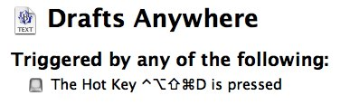

bbdrafts
========
Create a new BBEdit temp file, intended as a poor substitute for [Drafts][] on OS X

## TL;DR Summary:

I press a keyboard shortcut, and [Keyboard Maestro][] creates and opens a temp file in a text editor, giving me quick access to start writing without having to make any decisions: no filenames, no directory, nothing. Just a blank slate to write in. Then I can copy it and paste it into whatever other app I want to use it.

## How To Install It

**Step 1)** Move `drafts.sh` to `/usr/local/bin/drafts.sh` and make sure it’s executable:

		chmod 755 /usr/local/bin/drafts.sh

**Step 2)** Unzip the Keyboard Maestro macro and double click on the `Drafts-Anywhere.kmmacros` file.

**Step 3)** Set the keyboard shortcut you want to use. 

By default it is set to `⌃⌥⇧⌘D` 
which is my 
[“hyper key”][1] but you might find it a bit awkward to press all those modifier keys.

## How It Works

You can set the directory by editing `drafts.sh` and changing this line:

		DIR="$HOME/Dropbox/Drafts"

If the directory does not exist, it will be created. If you use [nvALT][], you might want to set it to that directory.

By default it will use BBEdit, or, more specifically, BBEdit’s command-line tool:

		if (( $+commands[bbedit] ))
		then
		
if you want to change it to a different program, change that to something else. As a fallback, it will use `edit` which is the command-line tool for [TextWrangler][]:

		elif (( $+commands[edit] ))
		then

If you want to use a different backup program, change `edit` to something else. If you want more backups, add more `elif` lines in the same format. At the very end, there is a fallback to use the `open` command which will use the `-t` flag to open the temp file with the default text editor, and if _that_ fails, it will use TextEdit.

		command open -t "$TEMPFILE" || command open -e "$TEMPFILE"

Oh, and that temporary file? It’s as random-but-useful as possible:

		TEMPFILE="${DIR}/${NAME}.${HOST}.${TIME}.$$.${RANDOM}.txt"

To translate that: it starts in the directory that you set, then it starts with the name of the shell script (`drafts` by default), followed by the hostname of the computer you are using, followed by the current timestamp (`%Y-%m-%d--%H.%M.%S`), followed by the process number, followed by a random digit.

That should be sufficient to make a file which will not be duplicated even if you were somehow sitting at two different computers at the exact same moment and triggered the script at the exact same moment.

If you want something simpler, 

		TEMPFILE="${DIR}/${TIME}.txt"

is probably sufficient.

*If a Mac version of [Drafts][] is ever released, I’ll be the first one to buy it. Until then, this will have to suffice.*

[1]:	http://brettterpstra.com/2012/12/08/a-useful-caps-lock-key/
[Drafts]:	http://agiletortoise.com/drafts/
[Keyboard Maestro]:	http://www.keyboardmaestro.com/main/
[nvALT]:	http://brettterpstra.com/projects/nvalt/
[TextWrangler]:	http://www.barebones.com/products/textwrangler/
